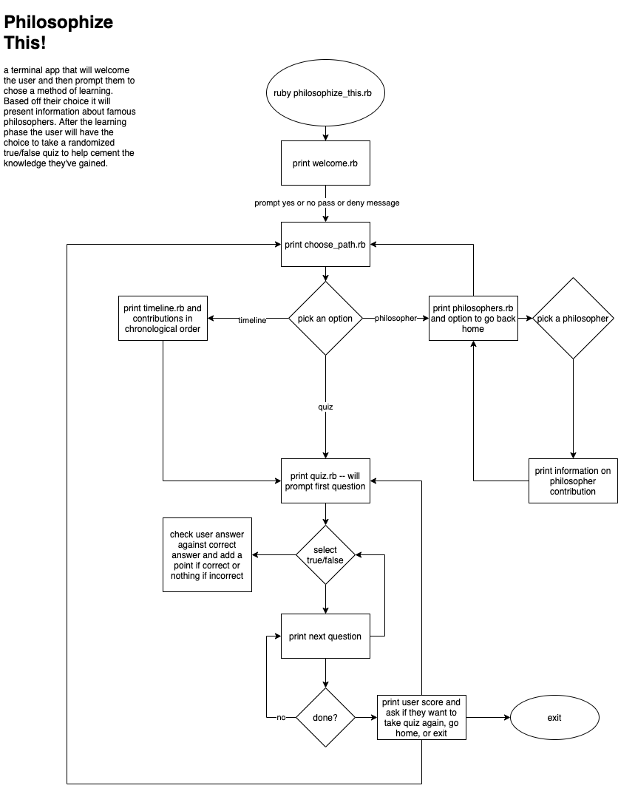

# RubyAppT1CA

## Source Control Link (R4) ##
--- 

[Github Repository](https://github.com/Ausiarm/RubyAppT1CA)

## Software Development Plan (R5) ## 
---

- #### What does it do? #### 
    - This simple ruby terminal application is designed to help users learn about some of history's most influential philosophical leaders. It will welcome users with an appropriate welcome message delivered in an artistic fashion. It will then ask if they want to learn about the great lovers of wisdom. If the user responds yes it will advance to a landing page with options to take a walk through time, choose a time period, or take a quiz, conversely, if they say no it will tell them they are in the wrong place and exit the app. If the user chooses yes then once at the landing page they will be able to select from the list the option they would like, all done with the arrow keys and the return/enter key. After choosing either of the learning options they will be directed to the quiz. When taking the quiz one must answer correctly to advance to the next question, of which there will be 5 chosen from a random selection of key value pairs in an array. after the quiz they will be prompted with a congratulatory message and the app will then exit at user click. 

- #### Problem solved and why #### 
    - I believe that the contributions of major philosophers are not understood well enough by our generation. There are many issues that we grapple with today that, taken through the lens of history and some of it's greatest thinkers, tend to break down into solvable problems. The only issue being that we, as a vain society, tend to believe that we are the first to come upon such issues. My hope is that by understanding some of the fundamental contributors to western thought and their attempts to provide ways of thinking around some of lifes' most complex conundrums, users of this app will perhaps enlighten their own view of life and how it is lived. 

- #### Target audience ####
    - The target audience for this terminal app is the 20-30 age range. Ideally I am aiming for those in a position in life where the acquisition of philosophical knowledge is actually beneficial rather than simply a metric for school to grade or a hobby to take up free time. It remains in a younger age group to account for the app's reliance on technology and the fear that latter age groups would normally not interact with something like a terminal app but rather an official text in order to gain such knowledge. 

- #### How will it be used by audience #### 
    - The goal for anyone using this app is that it should be a quick hit of information followed by a way of cementing that information in the form of a quiz to test a user's retention. I wouldn't want anyone to fear use of this app and for this reason I am to make it something that one would only have to dedicate about 5 minutes of their time to. It should read more like a tweet on twitter and less like a paragraph in a book. One would use this in a situation where they perhaps wanted a break from work that wasn't mind numbing like watching tv. 

## List of Features (R6) ##
--- 

<ol>
    <li>Walk Through Time</li> This option will start the user at the beginning of the timeline of philosophers that are included in the app. It will allow them to first view name and time period of the philosopher. From there they can advance to a brief snippet of info on the philosopher's major idea or contribution. this process will repeat until they go through the whole list. At the end of the list they will be sent to the Quiz.
    <li>Choose your Time</li> This option, instead of forcing the user to see all philosophers involved, will instead let them select from the list of philosophers included by using the arrow and enter keys. Once they select they will be able to return to the list whenever they like. At the bottom of the list will be the option to advance to the quiz. 
    <li>Quiz</li> The quiz will be a randomly generated set of 5 true or false questions from an array of key value pairs. User's will have to answer correctly before advancing to the next question in the set. 
</ol>

## User Interaction Outline (R7) ## 
---

- how the user will find out how to interact with / use each feature
    - Upon entry to the welcome page the user will be informed about navigation of the app. This introduction will prompt the user to answer a yes or no question and in doing so they will utilize the only methods of interaction necessary to access the full suite of features within the application. 
- how the user will interact with / use each feature
    - User interaction is to be handled solely by use of the arrow keys as well as the enter key. The user will not be prompted to enter a name as it will not be necessary for the functioning of the application. 
- how errors will be handled by the application and displayed to the user
    - In the case of an error, say JSON failing to return the stored data, the user will be prompted with a printed unable to access data message. 

## Control Flow Diagram (R8) ##
---

## Implementation plan (R9) ##
---

[Trello Planning Board: Ruby Terminal App](https://trello.com/b/04Sm6RTq/philosophizethis)

## Help Documentation (R10) ##
---

- to be completed once done with app with full knowledge of how to run and install it