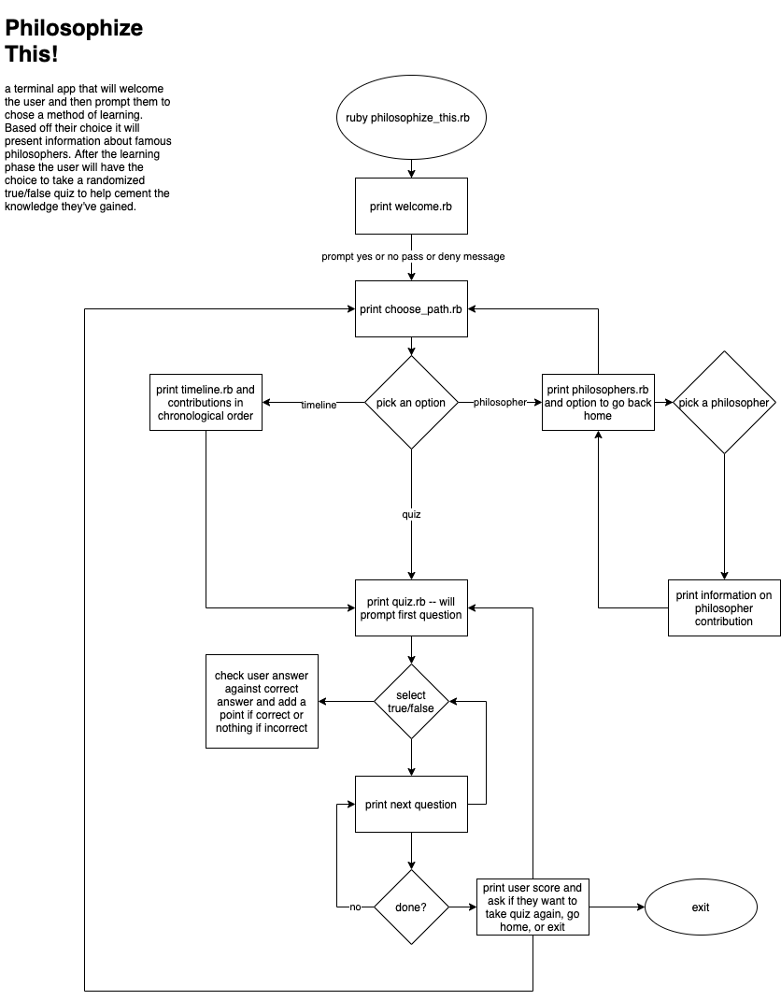
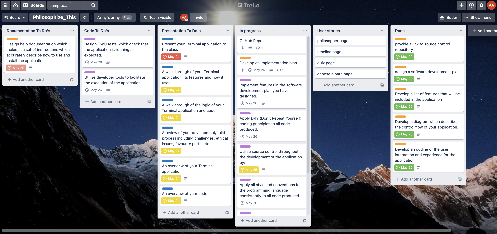

# RubyAppT1CA

## Source Control Link ##
--- 

[Philosophize This!](https://github.com/Ausiarm/RubyAppT1CA)

## Software Development Plan ## 
---

- #### What does it do? #### 
    - This simple ruby terminal application is designed to help users learn about some of history's most influential philosophical leaders. It will welcome users with an appropriate welcome message delivered in an artistic fashion. It will then ask if they want to learn about the great lovers of wisdom. If the user responds yes it will advance to a landing page with options to take a timeline approach to learning, choose a time period, or take a quiz. If at this entry point the user says no then the app will jocularly inform them they are in the wrong place. If the user chooses yes then once at the landing page they will be able to select from the list the option they would like, all done with the arrow keys and the return/enter key. After choosing either of the learning options and taking their time to learn what it is that they may be interested in they will be directed to the quiz. When taking the quiz one must answer true or false (if the user types the answer incorrectly they will be prompted to enter the correct spelling for the answer), and the quiz will move through an array of twelve questions. After the quiz they will be prompted with a congratulatory message if they have scored above 9 points and be given the option to exit or return to the landing page. If they score below 9 points they will be given the option to retake the quiz or not and if they choose not to they will then be prompted to go home or exit and the app will then exit at user click. 

- #### Problem solved and why #### 
    - I believe that the contributions of major philosophers are not understood well enough by our generation. There are many issues that we grapple with today that, taken through the lens of history and some of it's greatest thinkers, tend to break down into solvable problems. The only issue being that we, as a vain society, tend to believe that we are the first to come upon such issues. My hope is that by understanding some of the fundamental contributors to western thought and their attempts to provide ways of thinking around some of lifes' most complex conundrums, users of this app will perhaps enlighten their own view of life and how it is lived. 

- #### Target audience ####
    - The target audience for this terminal app is post university students in the 24-30 age range. Ideally I am aiming for those in a position in life where the acquisition of philosophical knowledge is actually beneficial rather than simply a metric for school to grade or a hobby to take up free time. It remains in a younger age group to account for the app's reliance on technology and the fear that latter age groups would normally not interact with something like a terminal app but rather an official text in order to gain such knowledge. 

- #### How will it be used by audience #### 
    - The goal for anyone using this app is that it should be a quick hit of information followed by a way of cementing that information in the form of a quiz to test a user's retention. I wouldn't want anyone to fear use of this app and for this reason I aim to make it something that one would only have to dedicate about 5 minutes of their time to. It should read more like a tweet on twitter and less like a paragraph in a book. One would use this in a situation where they perhaps wanted a break from work that wasn't mind numbing like watching tv. 

## List of Features ##
--- 

<ol>
    <li>Timeline</li> This option will start the user at the beginning of the timeline of philosophers that are included in the app. It will allow them to first view name and time period of the philosopher. From there they can advance to a brief snippet of info on the philosopher's major idea or contribution. this process will repeat until they go through the whole list. At the end of the list they will be sent to the Quiz.
    <li>Choose your philosopher</li> This option, instead of forcing the user to see all philosophers involved, will instead let them select from the list of philosophers included by using the arrow and enter keys. Once they select they will be able to return to the list whenever they like. At the bottom of the list will be the option to advance to the quiz. 
    <li>Quiz</li> The quiz will be a randomly generated set of 5 true or false questions from an array of key value pairs. User's will have to answer correctly before advancing to the next question in the set. 
</ol>

## User Interaction Outline ## 
---

- How the user will find out how to interact with / use each feature
    - Upon entry to the welcome page the user will be informed about navigation of the app. This introduction will prompt the user to answer a yes or no question and in doing so they will utilize the only methods of interaction necessary to access the full suite of features within the application. From this point on the app will prompt the user with whatever response is necessary in order for them to advance. Ultimately, the app assumes no background knowledge on the part of the user and each interactive step is explained simply and clearly.
- How the user will interact with / use each feature
    - User interaction is to be handled by prompts that will ask the user a question or present them with a statement that will direct them as to how they must go about interacting with the app. If incorrectly entered the prompt will inform the user of the error of input and prompt them to try again.  
- How errors will be handled by the application and displayed to the user
    - In the case of an error, say JSON failing to return the stored data, the user will be prompted with a printed unable to access data message. 

## Control Flow Diagram ##
---



## Implementation plan ##
---

### [Trello Planning Board: Ruby Terminal App](https://trello.com/b/04Sm6RTq/philosophizethis) ###

<br>

### Beginning stages of planning ###


<br>

### In progress representation of tasks being completed and shifted ###


<br>

### Final pass of implementation plan, completing last steps before turn-in ###


## Help Documentation ##
---

### Installation and Running ###

1. Ruby must be installed on the computer which you plan to run this application on. Installation instructions for ruby can be found [here](https://www.ruby-lang.org/en/downloads/).

<br>

2. This app has several dependencies in the form of gems, once ruby is installed in step one, simply enter the code under each gem into the terminal in order to install and have access to the use of these requisite gems.

<br>

- gem "rspec", "~> 3.10"

    ``` 
        gem install rspec 
    ```

- gem "colorize", "~> 0.8.1"

    ``` 
        gem install colorize 
    ```

- gem "artii", "~> 2.1"

    ``` 
        gem install artii 
    ```

- gem "tty", "~> 0.5.0"

    ``` 
        gem install tty 
    ```

- gem "json", "~> 2.5"

    ``` 
        gem install json 
    ```
<br>

3. In terminal, navigate to the appropriate directory where you would like to store the files necessary to run the app and then proceed to clone the Philosophize This! repository from [github](https://github.com/Ausiarm/RubyAppT1CA). For those who may have never cloned a repository before, please have a look at this guide which will simplify the process and help you to understand how this is [done](https://docs.github.com/en/github/creating-cloning-and-archiving-repositories/cloning-a-repository-from-github/cloning-a-repository). 

<br>

4. Once the three steps above have been completed, in terminal change directory (or cd) into the correct directory where you stored the app and then enter `RubyApp/src`. Once here enter chmod +rx ./run_app.sh which will turn the script file into an executable on your local repository/ and or confirm that it is executable. Then in the command line type `./run_app.sh` and hit enter, this will execute the script that will initate the application. 

<br>

 Hardware Requirements

- This application was created and tested on a mac. It should work in a windows environment but unfortunately I have not had access to a non-mac computer in order to test this. There are no specifc hardware requirement necessary to run this application. 